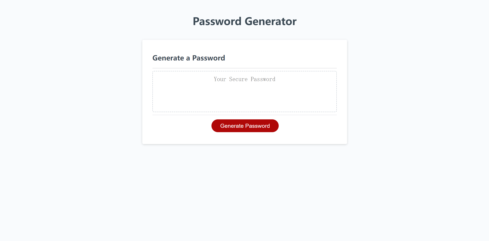
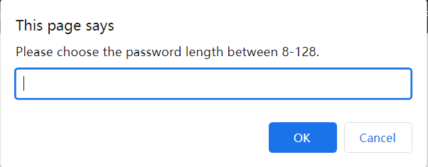
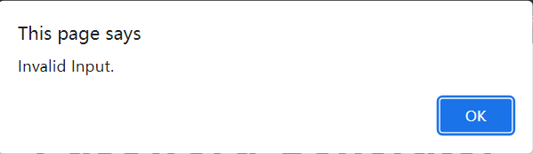
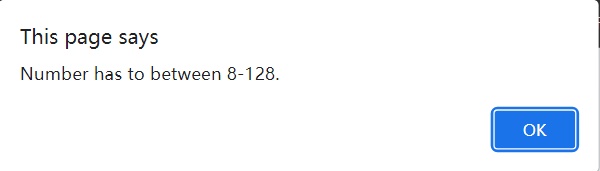
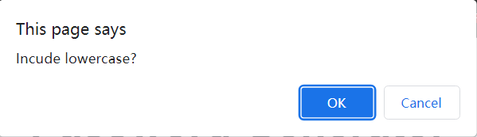
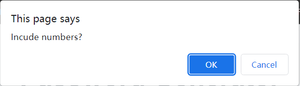
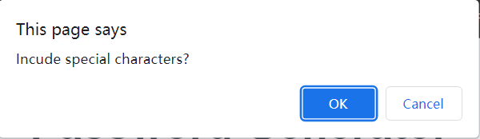
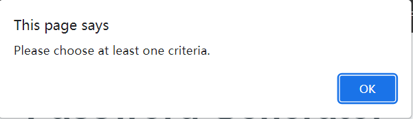
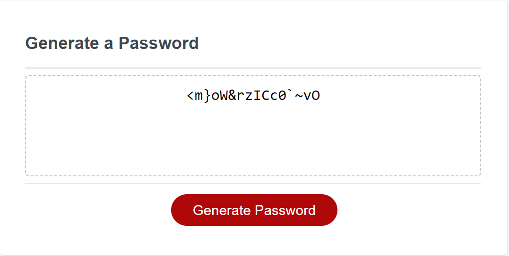

# Password Geneator

- [Description](#description)
- [Visulization and Usage](#visulization-and-usage)
- [Contribution](#contribution)
- [License](#license)

## Description

Simple password generator with customizable criterias

Made with Html, CSS and Javascript

## Visulization and Usage

> Screenshot when initializing password generator

> Click on the `Generate Password` button to start

> In the first prompt you MUST enter a number between 8-128

> If you enter a non-numeric value

> If you enter a numeric value NOT between 8-128

> In either case you have to re-enter the number again

> After you have a valid password length
>
> Following prompts will show in order :

> 1. If the password contains lowercase letters:

> 2. If the password contains uppercase letters:

> 3. If the password contains numbers:

> 4. If the password contains special characters:

> You MUST select at least one criteria, or you wil received an alert and all the criterias will be re-prompted again

> Now you have a random password!

## Contribution

Pull requests are welcome. For major changes, please open an issue first to discuss what you would like to change.

## License

MIT License 

Copyright (c) 2022 hmhtom

Permission is hereby granted, free of charge, to any person obtaining a copy
of this software and associated documentation files (the "Software"), to deal
in the Software without restriction, including without limitation the rights
to use, copy, modify, merge, publish, distribute, sublicense, and/or sell
copies of the Software, and to permit persons to whom the Software is
furnished to do so, subject to the following conditions:

The above copyright notice and this permission notice shall be included in all
copies or substantial portions of the Software.

THE SOFTWARE IS PROVIDED "AS IS", WITHOUT WARRANTY OF ANY KIND, EXPRESS OR
IMPLIED, INCLUDING BUT NOT LIMITED TO THE WARRANTIES OF MERCHANTABILITY,
FITNESS FOR A PARTICULAR PURPOSE AND NONINFRINGEMENT. IN NO EVENT SHALL THE
AUTHORS OR COPYRIGHT HOLDERS BE LIABLE FOR ANY CLAIM, DAMAGES OR OTHER
LIABILITY, WHETHER IN AN ACTION OF CONTRACT, TORT OR OTHERWISE, ARISING FROM,
OUT OF OR IN CONNECTION WITH THE SOFTWARE OR THE USE OR OTHER DEALINGS IN THE
SOFTWARE.
